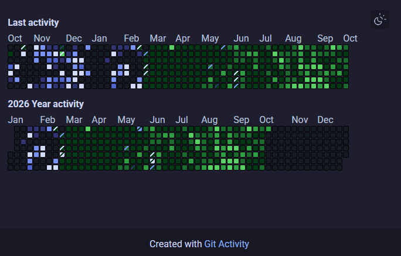
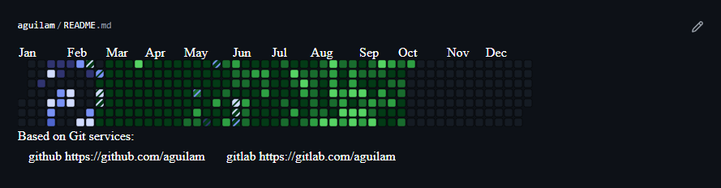

# Git Activity

Utility for collecting and showcasing your activity across all Git services you use

**Supported Services**

- Github
- Gitlab

## Output

After end of utility work you get `dist`directory containing:

HTML page with last and 2026 year activity



Two SVG files: one with your last year activity and one for your 2026 activity  


## How to use

Example of github workflow yml for updating activity every week. 

This workflow use workflow from this repository, for download, execute and publish result to Github Pages. 

In example if you execute this in your account repository, you can use this URLs: 

- **Year activity**: https://{username}.github.io/{username}/images/year_activity_750_150.svg
- **Last year activity**: https://{username}.github.io/{username}/images/current_activity_750_150.svg
- **HTML page**: https://{username}.github.io/{username}/

```
name: Git Activity

on:
  schedule:
    - cron: '0 0 * * 1'

  workflow_dispatch:

jobs:
  deploy:
    uses: aguilam/git-activity/.github/workflows/deploy.yml@main
    permissions:
      contents: read
      pages: write
      id-token: write

    secrets:
      config: ${{ secrets.ACTIVITY_CONFIG }}
```


## Config

The utility requires a configuration in following format:

```
services:

  - username: {username}
    token: {token}
    service: {service_name}
    
  - username: {username}
    service: {service_name}
```

Where:

- **Username** - your username on Git service
- **Token** - your service API token. Add it if you want include commits from private repositories to statistic
- **Service** - the service name. Currently supported values: `github`, `gitlab`

